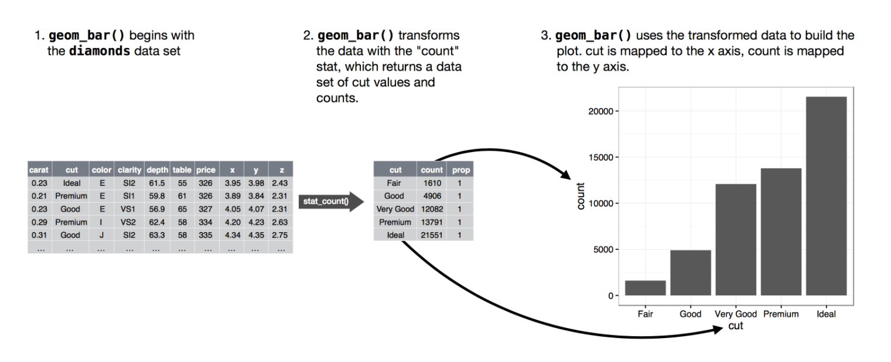
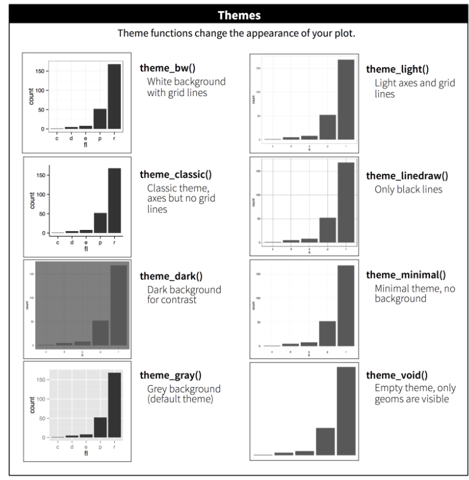

```{r setup, include=FALSE}
knitr::opts_chunk$set(echo = TRUE, warning = FALSE, message = FALSE)
```

```{r echo = FALSE}
library(dplyr)
library(ggplot2)
```

<br>
Aún cuando usaremos varios paquetes para la construcción de gráficos, el principal será `ggplot2`. Estas notas están basadas en el siguiente texto:

Wickham, H. 2019. ggplot2: elegant graphics for data analysis.<br> <https://ggplot2-book.org/>
<br>

# ¿Cómo construir un gráfico en <code>ggplot2</code>?

`ggplot(data = <DATOS>) + <GEOM_FUNCTION>(mapping = aes(<MAPPINGS>))`

# Aesthetic

Un `aesthetic` es una propiedad visual de los objetos en el gráfico como, por ejemplo, tamaño (`size`), forma (`shape`) y color (`colour`). Si se quiere asociar una de estas propiedades visuales al nombre de una variable, se debe realizar al interior de `aes()`.  

Por ejemplo, `shape` permite el uso de distintas formas para representar una o varias variables como: 

```{r echo = FALSE, fig.asp= 1, fig.height= 3, fig.width= 3, fig.align='center'}
df_shapes <- data.frame(shape = 0:24)
ggplot(df_shapes, aes(0, 0, shape = shape)) +
  geom_point(aes(shape = shape), size = 5, fill = 'red') +
  scale_shape_identity() +
  facet_wrap(~shape) +
  theme_void()
```

# Geoms

Un *geom* es el objeto geométrico que un gráfico usa para representar los datos. En muchos casos, *geom* define el tipo de gráfico; en otros, se pueden combinar varios para construir un gráfico.

`ggplot2` provides over 40 *geoms*. A continuación se presentan los más usados:

geom           | Descripción 
---------------|---------------------
geom_point     | gráfico de dispersión 
geom_bar       | gráfico de barras
geom_col       | gráfico de barras
geom_line      | gráfico de líneas
geom_boxplot   | diagrama de caja
geom_histogram | histograma
geom_hline     | línea de referencia horizontal
geom_vline     | línea de referencia vertical
geom_abline    | línea de referencia
geom_rect      | rectángulo
geom_segment   | segmento de línea

Además, existen una serie de paquetes que extienden `ggplot2`, algunos de los cuales pueden encontrarse en:

<https://exts.ggplot2.tidyverse.org/gallery/>

Por ejemplo, el paquete `calendR` permite crear calendarios personalidados: 

```{r fig.heith= 9, fig.with = 6}
library(calendR)
calendR(mbg.col = 4,
        months.col = "white",
        col = "#ffffff",
        weeknames = c("L", "M", "M",
                      "J", "V", "S", "D"),
        day.size = 2.5)
```


# ¿geom_bar() o geom_col()?

- `geom_bar()` hace que la altura de la barra sea proporcional al número de casos en cada grupo (o si se incluyen *weights*, la altura es proporcional a la suma de éstos). Usa `stat_count()` por defecto, es decir, cuenta el número de casos en cada posición en el eje X. 
- `geom_col()` hace que la altura de la barra sea igual a los valores en los datos. Usa `stat_identity()`, representando los datos tal cual se presentan en la base de datos.

# Transformaciones estadísticas

Un gráfico de barras generados con `geom_bar()` muestra el número de casos en cada grupo o  categoría de una variable. El algoritmo usado para calcular los valores es llamado *stat* 



# Facets

La separación de gráficos de acuerdo a distintos valores de una variable puede realizarse para una sola variable usando `facet_wrap` o una combinación de dos variables a través de `facet_grid`. Se recomienda también revisar `grid.arrange` del paquete `gridExtra`.

# Etiquetas

Para añadir etiquetas puede usarse `labs()` al interior del cual pueden agregarse:

- `title`
- `subtitle`
- `caption`
- `x`
- `y`

Además, pueden incluirse expresiones matemáticas en lugar de texto, reemplazando "" por `quote()`. Se recomienda revisar opciones en `?plotmath`

# Anotaciones

Si se quiere etiquetar una observación o un grupo de éstas, se puede usar `geom_text()`, `geom_label()` y `annotate()`. Se recomienda revisar: <https://ggplot2.tidyverse.org/reference/geom_text.html> y <https://ggplot2.tidyverse.org/reference/annotate.html>


# Escalas

Las escalas controlan cómo los datos son representados en el gráfico como, por ejemplo, colores, breaks en el eje X o Y, leyendas, etc.

Entre las escalas de colores más utilizadas son las de ColorBrewer que está documentada en <http://colorbrewer2.org/> y se encuentra disponible en el paquete `RColorBrewer`. A continuación se presentan 3 tipos de escalas de colores: secuencial, cualitativa y divergente.

```{r fig.height=10, echo = FALSE}
RColorBrewer::display.brewer.all()
```

# themes

Pemiten personalizar las partes de un gráfico no relacionadas a datos. `ggplot2` incluye los siguientes 8 *themes*: 



Además, el paquete `ggthemes` contiene una lista de *themes* adicionales, los cuales pueden revisarse en <https://cran.r-project.org/web/packages/ggthemes/ggthemes.pdf>

Por otra parte, se puede acceder a una mayor personalización de un gráfico especificando en *theme* los elementos de un gráfico que se desean modificar. Por ejemplo, para cambiar la posición de `legend` usar `theme(legend.position = )`. Por defecto, la ubicación de la leyenda será a la derecha del gráfico.

Los componentes necesarios para llevar a cabo la personalización de un gráfico incluyen:

- Elementos

Especifican los elementos no relacionados a datos que se pueden controlar. Por ejemplo, `plot.title` controla la apariencia del título del gráfico, `axis.ticks.x` controla los ticks (marcadores) en el eje X.

- Funciones

Cada elemento está asociado con una función específica. Por ejemplo, `element_text()` puede controlar el tamaño de la fuente, color y si se usa o no itálica o negrita en elementos como `plot.title`. Hay cuatro tipos de `element_text()`, `element_line()`, `element_rect()` y `element_blank()`. La especificación de elementos y funciones al interior de `theme` se realiza de la siguiente forma:

`theme(element.name = element_function())`

Para una más completa revisión de las opciones disponibles, se recomienda revisar: <https://ggplot2.tidyverse.org/reference/theme.html>

# Tamaño de una figura

Para controlar el tamaño de una figura existen cinco opciones: `fig.width`, `fig.height`, `fig.asp`, `out.width` y `out.height`.

# ¿Cómo guardar un gráfico?

Se puede usar `ggsave`. Se recomienda revisar:
<https://ggplot2.tidyverse.org/reference/ggsave.html>
