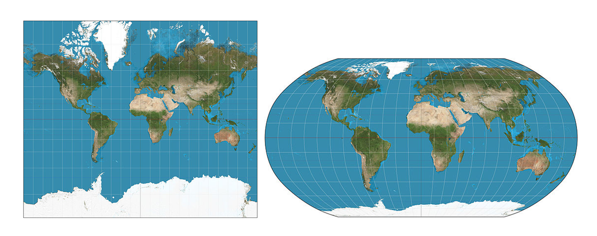

```{r setup, include=FALSE}
options(htmltools.preserve.raw = FALSE, warning = FALSE, message = FALSE)
```


class: bottom, right

## El uso de mapas representación visual de variables en el espacio 


---

class: bottom, right

## distorsiona

---
class: middle

## Mapas coropléticos

Este tipo de mapas representa areas geográficas coloreadas en relación a una variable numérica. Permite visualizar cómo los valores de una variable se distribuyen en el territorio.

---

paleta de colores divergentes no es una buena elección, a menos que se esté comparando los valores en relación a un valor determinado.  usar paleta de colores secuencial.

---

Todos los mapas distorsionan la superficie de la Tierra, ya que se requiere proyectar la forma tridimensional esférica de nuestro planeta en un plano de dos dimensiones. 


---

class: middle

- Mercator desarrollada por el geógrafo Gerardus Mercator en 1569 y para navegación. Sin embargo, esta proyección distorsiona el tamaño de los países localizados cercanos a los polos, haciéndolos aparecer más grandes de lo que realmente son.

---

class: middle, center


En la proyección de Mercator (izquierda), Groenlandia aparece un poco más grande que América del Sur, a pesar de que en la realidad su superficie es aproximadamente un octavo. En cambio, la proyección de Robinson (derecha) 



https://en.wikipedia.org/wiki/File:Mercator_projection_SW.jpg
https://en.wikipedia.org/wiki/File:Robinson_projection_SW.jpg
