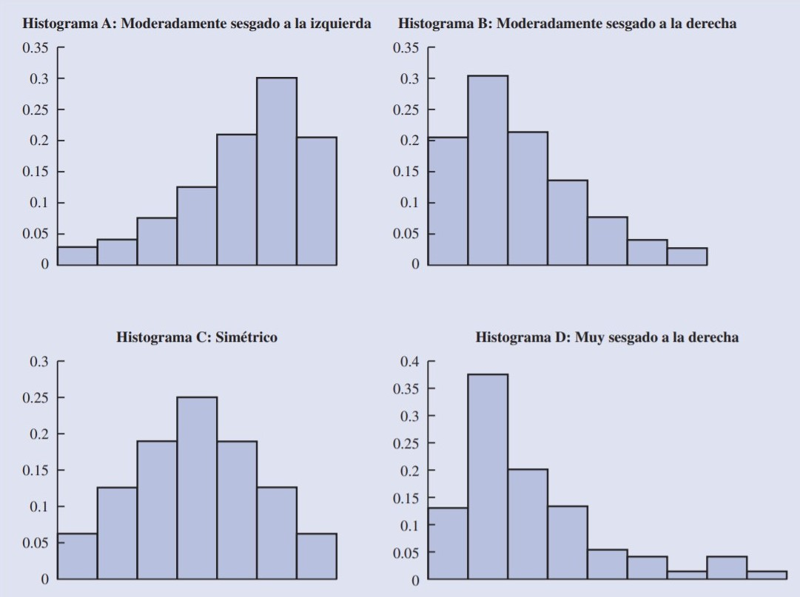
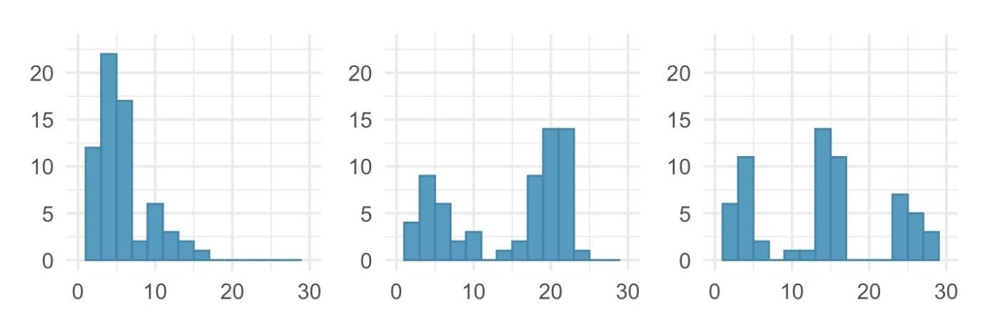

```{r setup, include=FALSE}
#options(htmltools.dir.version = FALSE)

options(htmltools.preserve.raw = FALSE, warning = FALSE, message = FALSE)
```

```{r echo = FALSE, message = FALSE, warning = FALSE}
library(ggplot2)
library(dplyr)
library(kableExtra)
library(openintro)
library(forcats)
library(janitor)
```

```{r echo = FALSE}
data(loan50)
data(loans_full_schema)
```

class: bottom, right

## Para comenzar el análisis de la distribución de datos cualitativos y cuantitativos, se discutirá la presentación de tablas y gráficos que resumen la distribución de dichos datos


---

class: middle

## Distribución de frecuencia

Una distribución de frecuencia es un resumen en forma de tabla de los datos que muestra el número (frecuencia) de elementos en cada una de las diferentes clases que no se sobreponen. 

--
### Variable cualitativa

Si la variable es cualitativa, las clases corresponden a las categorías que contiene la variable.

--
### Variable cuantitativa

Si la variable es cuantitativa, los datos deben agruparse para construir las clases.


---

class: middle

## Distribución de frecuencia relativa 

Muestra un resumen tabular de datos en el que se muestra la frecuencia relativa de cada clase.

$$Frecuencia \hspace{0.1cm}relativa\hspace{0.1cm} de\hspace{0.1cm} una\hspace{0.1cm} clase = \frac{Frecuencia \hspace{0.1cm} de \hspace{0.1cm} la\hspace{0.1cm} clase}{n}$$

## Distribución de frecuencia porcentual 

Muestra la frecuencia porcentual de los datos de cada clase.

$$Frecuencia \hspace{0.1cm}relativa\hspace{0.1cm} de\hspace{0.1cm} una\hspace{0.1cm} clase = \frac{Frecuencia \hspace{0.1cm} de \hspace{0.1cm} la\hspace{0.1cm} clase}{n} \times 100$$

---

class: bottom, right

## A continuación usaremos el conjunto de datos *loan50* que se encuentran disponibles en el paquete *openintro* para aplicar estos conceptos

---
class: inverse, center, middle

# Resumen de datos cualitativos

---

class: middle

# Tabla

La siguiente tabla muestra la distribución de frecuencias, frecuencia relativa y frecuencia porcentual de la variable `homeownership`.

```{r}
loan50 %>%
  group_by(homeownership) %>%
  tally(sort = TRUE) %>% 
  mutate(frec_relativa = n/sum(n), frec_porcentual = frec_relativa*100) %>%
  kbl() %>%
  kable_styling(bootstrap_options = "striped", font_size = 12)
```


---

class: middle

## Gráfica de barras y de pastel

Dos tipos de gráficos que se usan para representar los datos cualitativos de una distribución de frecuencia, frecuencia relativa o frecuencia porcentual.

---

class: middle

# Gráfico de barras

```{r fig.width = 6, out.width = "70%", fig.align = "center", fig.asp = 0.618}
loan50 %>% ggplot(aes(x = fct_infreq(homeownership))) +
  geom_bar(fill = "#3fa3ab", color = "#000000") +
  labs(x = "homeownership", y = "Frecuencia") +
  theme_classic()
```

---

class: middle

# Gráfico de pastel o torta

```{r fig.width = 6, out.width = "70%", fig.align = "center", fig.asp = 0.618}
loan50 %>%
  group_by(homeownership) %>% tally(sort = TRUE) %>% 
  mutate(frec_relativa = n/sum(n), frec_porcentual = frec_relativa*100, 
         ypos = cumsum(frec_porcentual)- 0.5*frec_porcentual) %>% 
  ggplot(aes(x= 0, y = frec_porcentual, fill = fct_reorder(homeownership, frec_porcentual))) +
  geom_bar(stat = "identity", width = 1, color = "white") + coord_polar(theta = 'y', start = 0) +
  geom_text(aes(x= 0.2, y = ypos, label = paste0(frec_porcentual,"%")), color = "white") +
  scale_fill_brewer(name = "Homeownership", palette="Set1") + theme_void()
```

---
class: inverse, center, middle

# Resumen de datos cuantitativos


---
class: middle

Para construir una distribución de frecuencias de datos cuantitativos, se requiere agrupar los datos en intervalos que no se intersectan. Cada dato debe pertenecer a sólo uno de dichos intervalos. Los pasos a seguir son los siguientes:

--
<ol>
  <li>Determinar el número de clases disjuntas</li>
--
  <li>Determinar el ancho de cada clase</li>
--
  <li>Determinar los límites de clase</li>
</ol>

---
class: middle

## Número de clases
Número de intervalos que se usarán para agrupar los datos.

## Ancho de cada clase

$$Ancho \hspace{0.1cm}de\hspace{0.1cm} la\hspace{0.1cm} clase = \frac{Valor \hspace{0.1cm} máximo - Valor \hspace{0.1cm} mínimo}{Número\hspace{0.1cm} de\hspace{0.1cm} clases}$$
Note que mientras mayor es el número de clases, menor es el ancho de cada una.

## Límite de clase
Valores mínimos y máximos de cada clase. El <em>punto medio de clase</em> es el valor que queda a la mitad entre el límite inferior y el límite superior de la clase

---
class: bottom, right

## Después de haber agrupado los datos cuantitativos en clases, se construyen las distribuciones de frecuencia, frecuencia relativa y frecuencia porcentual, de la misma manera que se hizo para datos cualitativos

---
class: middle

A continuación se presentan los pasos para el cálculo de la distribución de frecuencias de la variable `interest_rate`

--

#### Determinar el valor mínimo y máximo de la tasa de interés
La tasa de interés mínima es `r paste0(min(loan50$interest_rate),"%")` y la tasa de interés máxima es `r paste0(max(loan50$interest_rate),"%")`.

--

#### Determinar el número de clases
Usaremos 9 clases para agrupar los datos de tasas de interés

--

#### Cálculo del ancho de cada clase
El ancho de clase es igual a:

$$Ancho\hspace{0.1cm} de\hspace{0.1cm} clase=\frac{27-5}{9}= 2.444$$

Se aproximará el ancho de cada clase a 2.5

--

Por lo tanto, los datos serán agrupados en las siguientes clases: $5 <i\leq7.5$, $7.5< i\leq10$, $10< i\leq12.5$, $12.5< i\leq15$, $15< i\leq17.5$, $17.5< i\leq20$, $20< i\leq22.5$, $22.5< i\leq25$, $25< i\leq27.5$


---
class: middle

# Tabla

La siguiente tabla muestra la distribución de frecuencias, frecuencia relativa y frecuencia porcentual de la variable `interest_rate`.

```{r}
rate_breaks <- c(5, 7.5, 10, 12.5, 15, 17.5, 20, 22.5, 25, 27.5)
loan50 %>% group_by(rate_cat = cut(interest_rate, breaks=rate_breaks)) %>%
  tally() %>% mutate(frec_rel = n/sum(n), frec_porc = frec_rel*100) %>%
  kbl() %>% kable_styling(bootstrap_options = "striped", font_size = 12)
```


---
class: middle

## Histogramas

Permite representar la distribución de frecuencias de datos cuantitativos, facilitando la visualización de los valores más comunes y la forma de la distribución de los datos.

---
class: middle

# Histograma 

El siguiente histograma representa la distribución de frecuencias de la variable `interest_rate`.

```{r fig.width = 6, out.width = "70%", fig.align = "center", fig.asp = 0.618}
loan50 %>% ggplot(aes(x = interest_rate)) + geom_histogram(breaks = seq(5, 27.5, 2.5), fill = "#3fa3ab", color = "#ffffff") +
  scale_x_continuous(breaks = seq(5, 27.5, 2.5), labels = seq(5, 27.5, 2.5)) +
  labs(x = "Tasa de interés (%)", y = "Frecuencia") + theme_classic()
```


---

class: bottom, right


## Dependiendo de la forma del histograma, se dice que la distribución es <b>simétrica, sesgada a la izquierda o sesgada a la derecha</b>

---

class: middle

.center[]

---

class: bottom, right

## Se dice que la distribución es <b>unimodal, bimodal o multimodal</b> si tiene uno, dos o más de dos peaks prominentes, respectivamente


---
class: middle

### ¿Cuál de las siguientes distribuciones es unimodal, bimodal o multimodal?

.center[]

---

class: middle

En base al histograma de la tasa de interés:

--

#### ¿Es la distribución simétrica, sesgada hacia la izquierda o sesgada hacia la derecha?

--

#### ¿Es la distribución unimodal, bimodal o multimodal?

---
class: middle

## Distribución de frecuencia acumulada 

Muestra la cantidad de datos que tienen valores menores o iguales al límite superior de cada clase.

## Distribución de frecuencias relativas acumuladas

Indica la proporción de todos los datos que tienen valores menores o iguales al límite superior de cada clase.

## Distribución de frecuencias porcentuales acumuladas 

Indica el porcentaje de todos los datos que tienen valores menores o iguales al límite superior de cada clase.

---

class: middle

# Tabla

La siguiente tabla muestra la distribución de frecuencia porcentual acumulada de la variable `interest_rate`.

```{r}
loan50 %>% group_by(rate_cat = cut(interest_rate, breaks=rate_breaks)) %>%
  tally() %>% mutate(frec_rel = n/sum(n), frec_porc = frec_rel*100, frec_porc_acum = cumsum(frec_porc)) %>%
  kbl() %>% kable_styling(bootstrap_options = "striped", font_size = 12)
```

---

class: bottom, right

## Hasta ahora hemos trabajado con tablas y gráficos usados para representar sólo una variable ¿Y si se quiere representar la relación entre dos variables?

---

class: middle

# Tabla cruzada

La siguiente tabla muestra la relación entre las variables `loan_status` y `homeownership`.

```{r}
loan50 %>% tabyl(loan_status, homeownership) %>% adorn_totals(c("row", "col")) %>%
  adorn_title("combined") %>% kbl() %>% kable_styling(bootstrap_options = "striped", font_size = 12)
```


---

class: middle

# Gráfico de dispersión

El siguiente gráfico muestra la relación entre las variables `total_income` y `loan_amount`.


```{r fig.width = 6, out.width = "70%", fig.align = "center", fig.asp = 0.618}
loan50 %>% ggplot(aes(x = total_income, y = loan_amount)) +
  geom_point(colour = "#3fa3ab", size = 2) +
  scale_x_continuous(labels = scales::label_number()) +
  theme_classic()
```


